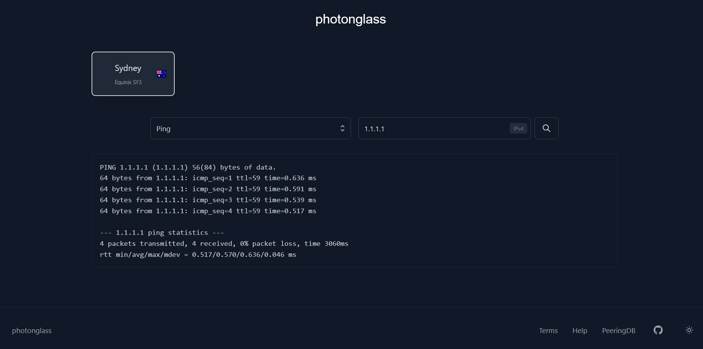

# photonglass
A modern, simple, distributed looking glass application that provides network insight for network operators.

## Features
- **Multi Device Support**: Connect to multiple devices from one single interface.
- **Easy Deployment**: Extremely easy to deploy and scale with multiple devices.
- **Webhook Logging**: Log queries to a webhook channel (optional).
- **Rate Limiting**: Reduce service abuse by rate limiting users, 100 requests per day and 10 requests per minute by default.

## Public Instances
If you wish to list your instance on this list, please open a Github issue.

| Organisation | Instance URL |
|------------------|-----------------|
| Demo | https://photonglass.dev |
| Host Universal | https://lg.hostuniversal.com.au |

## Setup (Docker)
1. Clone repository
    - `git clone https://github.com/AliMickey/photonglass.git`
2. Create an instance folder to store your config and logos/favicon
    - `cd photonglass`
    - `mkdir instance`
    - `mkdir instance/images` # Optional
    - `mkdir instance/ssh-keys` # Optional
3. Create config files and upload logos/favicon
    - Refer to [CONFIGURATION.md](CONFIGURATION.md)
4. Create `docker-compose.yml`
    - Refer to [CONFIGURATION.md](CONFIGURATION.md)
4. Build and deploy the container (inital build may take a minute)
    - `docker compose up -d --build`
5. View the app at `http://IP_ADDRESS:5000`, recommend using a reverse proxy (traefik) for production use. 

## Attribution
This project was inspired by [hyperglass](https://hyperglass.dev/) after having difficulty deploying it as well as being overkill for what I wanted. This project is not meant as a 1:1 replacement with hyperglass and as such is kept simple by design. At time of release only Linux servers were tested as a target device, the same device library as hyperglass is used (netmiko) so compatibility with more devices should not be an issue, just be aware it is untested.
